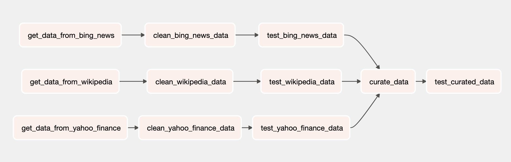
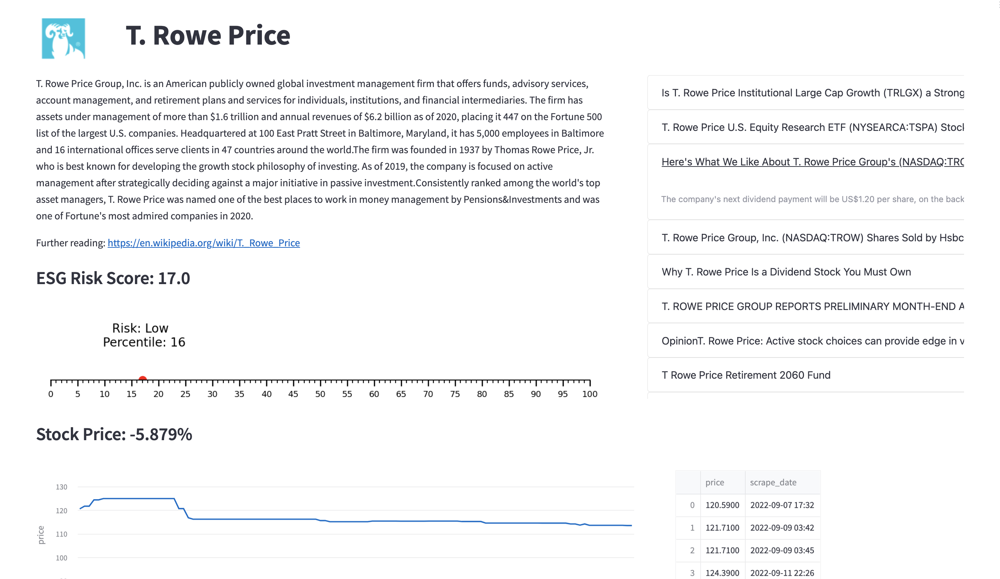

# GHC 2022 9/23: Demystifying Data Engineering

## Overview
The goal of this workshop is to demystify data engineering and demonstrate some
of the important concepts and principles of data engineering via a toy data pipeline.

This repo contains a pipeline that scrapes the ticker price of a company from Yahoo Finance, recent articles about the company from Bing News, and information about the company from Wikipedia.

We visualize the data that we've acquired using a simple Streamlit app.

Most data engineering workflows make use of cloud computing services and cloud data
warehouses such as AWS, GCP, Azure, and Snowflake, but in order to be accessible and
replicable, this demo is set up to run locally.

## Setup
1. **Clone the repo**
2. **Change configuration paths**  \
The configuration file `demo/airflow/airflow.cfg` contains a number of paths that tell Airflow where to access certain resources. Change any paths that contain `/Users/trpij38/Documents/GHC-talk` to include the path of your own cloned repo directory instead, which you can find by typing `pwd` into your terminal. `demo/airflow/dags/demo_dags.py` and `demo/great_expectations/great_expectations.yml` also contain paths that need changing. (Tip: you can find all paths that need to be changed with `git grep -rn "/Users/trpij38/Documents/GHC-talk"`)
3. **Create and activate a virtual environment**  \
`python3 -m venv ghc-venv` will create a new virtual environment called `ghc-venv`, and a new directory of the same name where libraries will be installed. We can then activate this virtual environment using `source ghc-venv/bin/activate`.
4. **Install requirements**  \
`pip install -r demo/requirements.txt`
5. **Set environment variables**  \
`export AIRFLOW_HOME=<path_to_your_cloned_repo>/demo/airflow`
6. **Spin up Airflow**  \
`airflow standalone`
7. **Record the password shown in the terminal**
8. **Access the Airflow UI**  \
Visit localhost:8080 with username `admin` and password from the previous step.
9. **Access the Streamlit App**  \
Running `streamlit run demo/company_report.py` will automatically open the application at localhost:8501 or localhost:8502.

## Concepts
- **Unstructured Storage**: \
Unstructured storage can contain any kind of object or data, and so is a great place for us to dump raw data that hasn't been processed yet. In our production stack, this would be a storage solution like AWS S3. For this demo pipeline, we will use the local directory `demo/files/` as our unstructured storage.
- **Structured Storage**:  \
Structured storage, otherwise known as a database, has rows and columns, and requires its data to fit a particular format. Since retrieval is fast and the organization of the data is well-defined, this is where we'll store the cleaned and processed data for our application to access. Normally we would use a cloud data warehouse like Snowflake, but in this pipeline, our structured storage will be the SQLite database contained in `demo/company_info.db`.
- **Orchestration**:  \
We use Apache Airflow, an open source tool originally developed at Airbnb, as our orchestration tool. Orchestration simply means programmatically managing the scheduling of tasks that need to happen in a certain order. `demo/airflow` contains everything needed to run Airflow-- the part most relevant to this demo is `demo/airflow/dags/demo_dag.py`, which is the file that defines our demo pipeline.
- **Minimizing Data Loss**: \
In order to minimize data loss, we store both the raw and the processed data our pipeline produces each time it runs. The more processing that gets done before storing an intial version of the data, the more room there is for things to go wrong -- since we can't go back in time and get what a webpage looked like in the past, saving an initial version as soon as possible minimizes the possibility of data loss. Saving the raw data at each point in time also serves as version control for our data.
- **Independence of Runs**: \
Sometimes we may want to rerun the DAG in the past, in order to fix errors or apply updated curation logic to data collected in the past. This is called backfilling. In order to do this, we need to make sure each run is independent of the others and the actual run date. We do this by labelling each piece of data with the execution date of the run that produced it, and having a run only touch the data associated with its execution date.
- **Idempotency**: \
Since tasks can be rerun at any time and run any number of times, we need to ensure that each run is idempotent. This means that no matter how many times the DAG is run, it will have the same effect as having been run once. We do this by associating each piece of data produced by a run with a unique id (which can be the execution date), and having our DAG overwrite previously produced data with the same ids.
- **Data Quality Testing**: \
We use a tool called Great Expectations to create and run our data quality tests. These tests (aka expectations) are manually generated based on domain knowledge of what the data should look like. `demo/great_expectations` contains all the configuration necessary to define and run these tests. You can read more about Great Expectations in the documentation linked below.

## Resources / Documentation

Airflow Local Setup: https://airflow.apache.org/docs/apache-airflow/stable/start/local.html

Airflow DAGs: https://airflow.apache.org/docs/apache-airflow/stable/concepts/dags.html

Airflow Architecture: https://airflow.apache.org/docs/apache-airflow/stable/concepts/overview.html

 

Streamlit Setup: https://docs.streamlit.io/library/get-started/installation

Streamlit Usage Guide: https://docs.streamlit.io/library/get-started/main-concepts

 

Great Expectations Documentation: https://docs.greatexpectations.io/docs/

Great Expectations Data Tests: https://greatexpectations.io/expectations

